# Unhash Protocol (DRAFT)

## Purpose

Provide a simple, performant content-addressed storage protocol.

### Use Cases

As a developer, I would like to import and run code by hash.

As a web surfer, I would like to download and view websites by hash.

### Existing Alternatives

There are many fantastic content-addressed storage systems, such as [IPFS](https://ipfs.io). However, their clients tend to be slow (from a cold start), difficult to use and
heavyweight.

This project was started after a failed attempt on Saturday, January 14th 2017
to download and use the Node.js IPFS client
[js-ipfs](https://github.com/ipfs/js-ipfs).

For example, at the time of writing (2017/01/14), the JavaScript `ipfs` module
depends on 536 other modules totalling 183 MB. I wasn't able to benchmark
loading a file from IPFS, because the README did not contain a code example
showing how to actually download a file and the CLI `cat` command threw an
exception:

```
Error: ENOENT: no such file or directory, open '/home/moon/.jsipfs/blocks/CIQJ2/CIQJ23BL4UHXA2KTI6NLTXZM4PW4VEFWQBJ4ACZQAS37BLGL4HUO5XY.data'
```

There is also an [IPFS API client](https://github.com/ipfs/js-ipfs-api) for
Node.js, however this client is not fault tolerant and requires configuring a
server instance.

Unhash is an attempt to fix this by providing a simple protocol which allows
zero-config, fault-tolerant clients to be implemented in a few hundred lines of
code with no major dependencies other than HTTPS and SHA-256.

We chose SHA-256 as the hash function to provide compatibility with IPFS, so
that Unhash hosts can use IPFS as a backend if they choose.

### Not in Scope

Unhash is intended for hosting small, static, individual files. Large file
hosting, streaming, mutable data, compression and multi-file archives are not in
scope. These things may be built on top of Unhash or a more comprehensive system
like [IPFS](https://ipfs.io) may be used.

## Principles

* Use existing, widely-used standards (HTTP, SHA-256, base64)
* Simple and good is better than complex and perfect

## Participants



The Unhash Protocol defines three roles:

* **Uploader**

  Acts as an HTTPS client and wants to upload a file to the Unhash Network.

* **Downloader**

  Acts as an HTTPS client and wants to download a file from the Unhash Network.

* **Server**

  Acts as the HTTPS server and wants to host files on behalf of clients.

## Protocol

### Retrieving a file

To retrieve a file, the downloader makes an HTTP GET request to a host:

``` http
GET /UNhY4JhezH9gQYqvDMWrWH9CwlcKiECVqejMrND2VFw HTTP/1.1
Host: unhash.link
```

If the server has the file, it responds with it:

``` http
HTTP/1.1 200 OK
Content-Length: 6

example
```

If the server does not have the file, it responds with a 404 error. In the
response header, it includes one or more hostnames of peers, separated by
commas. The server SHOULD choose those peers it thinks are most likely to have
the file.

``` http
HTTP/1.1 404 Not Found
X-Unhash-Peers: otherhost1.example,otherhost2.example
```

Generally, downloaders SHOULD have a set of default (bootstrap) hosts
preconfigured. These are hosts known to have good performance, uptime and many
files.

### Cross-domain access

Servers must support [Cross-Origin Resource Sharing (CORS)](https://developer.mozilla.org/en-US/docs/Web/HTTP/Access_control_CORS).
This allows browser-based clients to use the protocol.

When receiving an HTTP request with the `Origin` header, the server MUST respond
with an `Access-Control-Allow-Origin: *`

```
GET /UNhY4JhezH9gQYqvDMWrWH9CwlcKiECVqejMrND2VFw HTTP/1.1
Host: unhash.link
Origin: example.com
```

``` http
HTTP/1.1 200 OK
Access-Control-Allow-Origin: *
Content-Length: 6

example
```

### Uploading

To upload a file to a server, the client will first `GET` the URL
`/.well-known/unhash.json`.

``` http
GET /.well-known/unhash.json
```

The server responds with a JSON object, containing the following keys:

* `upload` (String) - URI where clients should POST to upload new files

``` http
HTTP/1.1 200 OK
Content-Type: application/json
```
``` js
{
  "upload": "https://upload.unhash.link/"
}
```

The client will then `POST` the file to be uploaded to the `upload_uri`.

``` http
POST /
Host: upload.unhash.link

example
```

Servers MAY require usage of a payment protocol in order to compensate them for
hosting the file. If no payment is provided, the server MUST respond with status
402. See also U-Unhash below.

``` http
HTTP/1.1 402 Payment Required
```

If the server already has the file, it MUST respond with status 200.

``` http
HTTP/1.1 200 OK
```

If the server did not already have the file, it MUST respond with status 201.

``` http
HTTP/1.1 201 Created
```

### Backwards compatibility

Unhash is backwards compatible with HTTPS. By creating a URI like `https://{host}/{hash}`,
any client capable of loading HTTPS will be able to load the file if the server
under `{host}` has it available.

Uploaders who wish to use this feature SHOULD choose a reliable host and make
sure the host has agreed to serve the file in question permanently.

Additional security is available in browsers via [Subresource Integrity](https://developer.mozilla.org/en-US/docs/Web/Security/Subresource_Integrity):

``` html
<script src="https://unhash.link/EE_znQZ7BcfM3LbsqxUc5JlCtE760Pc2RV18tW90DCo"
        integrity="sha256-EE/znQZ7BcfM3LbsqxUc5JlCtE760Pc2RV18tW90DCo="></script>
```

## Security

Content-addressed storage is secure as long as the underlying cryptographic hash
function (in this case SHA-256) is secure.

Whether a file can be successfully downloaded depends on whether any of the
servers chosen by the clients are willing and able to provide it.

If at least one of the initial set of bootstrap servers is honest, it will
either provide the file or links to further servers the client can try.

Therefore, if the client queries all servers it learns about and one of the
servers that has the file is connected by a chain of honest peers to one of the
client's set of bootstrap servers, the client will eventually retrieve the file.

In practice, however, malicious servers can attempt to slow down this process to
the point that it becomes impractical.

### Sybil attack

A dishonest server could respond with a long list of peers which are all also
malicious.

In order to mitigate the effects of this attack, clients SHOULD prioritize peers
to query as follows:

* Peers in the bootstrap set have priority 0 (highest)
* When peers are recommended by a server, the n-th recommended peer has a
  priority equal to the priority of the server which recommended it plus n
* When a peer is assigned multiple priorities (e.g. because it is recommended
  by multiple servers), the numerically lowest priority is used.

For example, suppose we start with one bootstrap peer `unhash.link`. This peer
recommends `otherhost1.example` and `otherhost2.example`. `otherhost1.example`
recommends `otherhost3.example` and `otherhost2.example` recommends
`otherhost3.example` and `unhash.link`. The resulting priorities are as follows:

* 0 `unhash.link`
* 1 `otherhost1.example`
* 2 `otherhost2.example`
* 2 `otherhost3.example`

Clients SHOULD query peers in numerically increasing order. If there are any
honest servers in the bootstrap set, this ensures that clients will follow their
recommended chain of peers, even if dishonest servers provide large numbers of
malicious recommendations.

### Large files

A dishonest server could respond to the client's request with a very large file.
The client would not be able to find out about this until the entire download is
complete, because it can't verify parts of the data using the hash, only the
complete file.

In order to address this, Unhash should only be used for small files. Unhash
download clients MAY enforce a limit on download size. This limit SHOULD be
user-configurable. If download of large files over Unhash is desired, the file
should be split into chunks by a higher level protocol and the individual chunks
should be fetched over Unhash.

## Performance

Unhash is designed for ideal performance in the case of well-known files. When
performance matters, we recommend that files should be uploaded to most
of the popular bootstrap hosts in the network. This could be the case for the
front page HTML of a popular website, or a popular piece of JavaScript.

Other files may be more sparsely available, such as a chunk from a large movie
download.

### Sticky Choices

Clients MAY provide more sophisticated logic for improving performance, such as
prioritizing servers which have served a file successfully (and quickly) in the
same session.

When downloading clients are aware of the relationship between resources and
subresources or other metrics allowing them to predict which server will be able
to serve a given file, they MAY use this information to prioritize servers more
efficiently.

### Low-bandwidth Clients

Low-bandwidth clients will have difficulty requesting files from multiple hosts.

If fault-tolerance is less of an issue, a low-bandwidth downloading client MAY
only try one host at a time, or use a proxy, i.e. a single Unhash host which is
configured to internally query multiple remote Unhash hosts.

## Incentives

Any file hosting protocol should explain its approach to incentives. Why would
anyone run servers and provide resources to the network?

On the web, the cost of file hosting is usually borne by the uploader. This
enables the downloader to access files relatively anonymously and with minimal
hassle, which works well for many use case such as publishing, providing
customer support and offering goods and services.

In some cases, the downloader is the one who has the greater incentive to
receive a file. For use cases like this, various solutions have been tried.
Peer-to-peer filesharing protocols like [BitTorrent](https://en.wikipedia.org/wiki/BitTorrent)
allow downloaders to contribute resources back to the system - contribution in
kind. Another approach is charitable hosting such as in the case of the
Internet Archive and Wikipedia. Here, downloaders voluntarily pay for the
resources they access, which unfortunately concentrates the entire cost of
running the service on a very small number of users who are willing to take the
time to donate.

We envision that Unhost would be powered by two different kinds of hosts,
clients and uploaders to reflect the difference of incentives across different
use cases.

### Uploader-financed Unhash (U-Unhash)

This document describes a model where hosts MAY request payment upon upload
and/or regular re-payment to prevent files from expiring. However, they MUST NOT
require payment from downloaders. This model matches the primary economic model
for hosting today.

U-Unhash uploaders MUST have payment functionality built-in. They SHOULD have
fairly intelligent rules for selecting hosts.

U-Unhash downloaders MAY be very simple clients. They do not have to support
payment functionality. This is the main reason why U-Unhash is attractive for
many use cases.

U-Unhash hosts MUST NOT provide D-Unhash hosts as recommended peers. U-Unhash
download and upload clients MUST NOT include D-Unhash hosts in their bootstrap
lists.

We expect that U-Unhash will be most commonly used for things like hosting
websites and source-code.

### Downloader-financed Unhash (D-Unhash)

Aside from the protocol described in this document, an alternative protocol
(D-Unhash) is possible where hosts MAY request payment upon download of a
resource. These hosts MAY offer features such as looking for the resource on a
distributed file-sharing system like IPFS. They may respond more slowly, but
will do more work to proactively find the file.

Downloaders will only continue paying/using a D-Unhash host if it delivers the
files they are looking for. So hosts are incentivized to proactively maintain
large databases of files and solicit uploads - perhaps even paying uploaders
whose uploads turn out to be popular.

D-Unhash download clients MUST have payment functionality built-in and are
therefore more complex than U-Unhash download clients.

D-Unhash hosts MUST NOT provide U-Unhash hosts as recommended peers. D-Unhash
download and upload clients MUST NOT include U-Unhash hosts in their bootstrap
lists.

We expect that D-Unhash will be most commonly used for sharing chunks of large
binary files.
